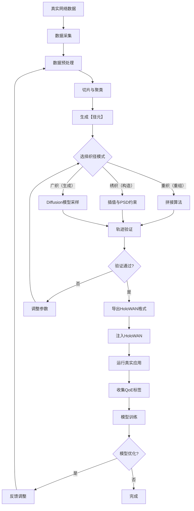

# 整体架构概述

## 数据流图

## 核心组件

### 1. 数据采集与预处理

- **数据源**：HoloWAN Playback 长期回放
- **覆盖范围**：多地域、多场景（含“西岑公寓”等典型弱网）
- **粒度**：100ms 级三元组（时延/丢包率/可用带宽）
- **预处理**：去噪、归一化、异常值处理

### 2. 切片与聚类

- **切片**：将原始数据切分为10秒的片段
- **聚类**：使用GMM（高斯混合模型）对片段进行聚类，生成【织律】
- **生成【径元】**：每个单元包含10秒片段 + GMM状态标签 + 1秒拼接尾

### 3. 织径模式

#### 重织（重组）
- 基于真实网络轨迹进行精确回放
- 将真实轨迹解构为【径元】丝线，依新【织样】重编，重织多样化的【故径】
- 拼接算法：导数对齐 + 频谱补纹，保障物理连续性

#### 绣织（构造）
- 按需编排网络状态序列
- 在关键位置精工调控，绣织一段高丢包、低带宽的【质径】
- 插值算法：Hermite 平滑 + PSD 约束，确保【质径】合理性

#### 广织（生成）
- 基于Diffusion模型生成新颖网络序列
- 挥洒算法想象力，广织千万条未历之【幻径】
- 采样策略：确保【幻径】符合物理边界与协议响应规律

### 4. 轨迹验证

- **多维度验证**：时延/丢包率/可用带宽各阶段评估指标
- **统计验证**：ACF/PSD对齐、Burstiness保留、CV匹配
- **端到端验证**：注入HoloWAN运行真实应用

### 5. 导出与应用

- **导出格式**：HoloWAN格式（.hwan）
- **应用场景**：性能测试、协议验证、模型训练
- **反馈循环**：基于应用QoE调整生成参数

## 设计原则

1. **真实性优先**：生成的轨迹必须高度保真
2. **可编程性**：支持灵活的轨迹定制
3. **可扩展性**：支持新的编织模式和验证方法
4. **模块化设计**：各组件松耦合，便于维护和扩展
5. **数据驱动**：基于真实数据训练和验证

## 架构优势

- **高度保真**：生成的轨迹与真实网络高度一致
- **灵活可编程**：支持多种编织模式和参数调整
- **可验证**：提供完整的验证体系
- **可扩展**：支持新的模型和算法
- **用户友好**：提供简洁易用的API

## 技术栈

- **开发语言**：Python 3.8+
- **核心依赖**：NumPy, Pandas, Scikit-learn, PyTorch
- **配置管理**：Pydantic Settings
- **日志工具**：Loguru
- **文档工具**：MkDocs + Material Theme
- **测试框架**：Pytest

## 性能指标

- **生成速度**：取决于编织模式，一般在秒级到分钟级
- **内存占用**：根据数据规模和模型大小而定
- **验证精度**：逼近真实参数训练上限

## 部署方式

- **本地部署**：直接运行Python脚本
- **Docker部署**：提供Docker镜像
- **API服务**：可部署为RESTful API服务