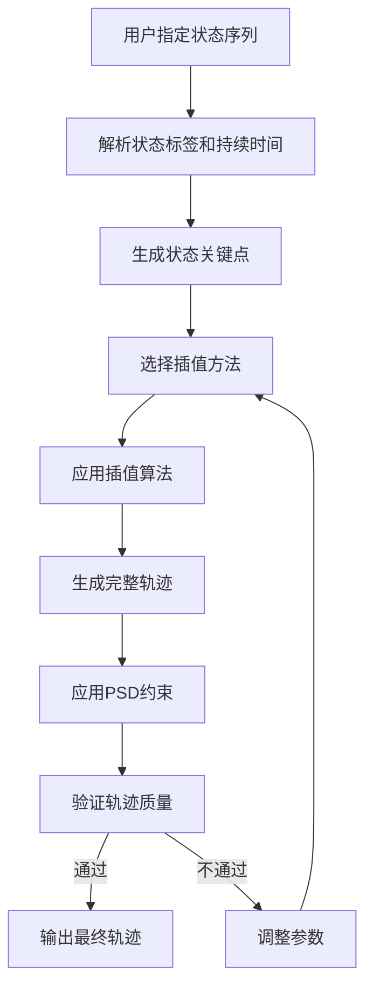

# 【造】：插值 + PSD 约束数学推导

## 【造】阶段概述

【造】阶段的目标是巧织新境，按需编排，构造质差之律。它允许用户自定义网络状态序列，支持调整每个状态的持续时间，可以组合不同的网络特性，用于构造特定网络条件下的测试环境。

## 插值算法

### 插值目标

- 根据用户指定的状态序列生成平滑的网络轨迹
- 支持调整每个状态的持续时间
- 确保生成的轨迹符合网络的物理特性
- 保持轨迹的连续性和自然性

### 插值方法

1. **基础插值**：
   - 线性插值：适用于参数变化较为平缓的情况
   - 样条插值：适用于需要更高平滑度的情况
   - 贝塞尔曲线插值：适用于需要精确控制过渡形状的情况

2. **状态感知插值**：
   - 根据状态的特性选择合适的插值方法
   - 例如：稳定状态使用线性插值，波动状态使用样条插值
   - 结合状态标签的语义信息进行插值

3. **时间尺度调整**：
   - 支持调整每个状态的持续时间
   - 可以延长或缩短特定状态的持续时间
   - 保持状态内的特性不变

### 插值流程

## PSD 约束数学推导

### PSD 约束目标

- 确保生成的轨迹具有与真实网络相似的频谱特性
- 防止生成的轨迹过于平滑或包含不真实的高频成分
- 保持轨迹的物理真实性

### 功率谱密度（PSD）基础

功率谱密度描述了信号功率在不同频率上的分布。对于网络参数序列，PSD可以反映网络抖动、突发等特性。

对于离散时间序列 \( x[n] \)，其功率谱密度定义为：

$$ P_x(f) = \lim_{N \to \infty} \frac{1}{N} E[|X_N(f)|^2] $$

其中 \( X_N(f) \) 是序列的离散傅里叶变换（DFT）。

### PSD 约束条件

1. **频谱一致性**：生成轨迹的PSD应与真实网络轨迹的PSD相似
2. **低频约束**：低频成分应符合网络延迟的物理特性
3. **高频约束**：高频成分应在合理范围内，避免不真实的抖动
4. **带宽约束**：可用带宽的PSD应符合实际网络的带宽特性

### 数学推导

#### 1. 目标函数

我们的目标是生成一个轨迹 \( \hat{x}[n] \)，使其在满足插值条件的同时，其PSD \( P_{\hat{x}}(f) \) 尽可能接近真实轨迹的PSD \( P_x(f) \)。

目标函数可以表示为：

$$ \min_{\hat{x}} \left( \lambda ||\hat{x} - x_{interp}||^2 + (1-\lambda) ||P_{\hat{x}}(f) - P_x(f)||^2 \right) $$

其中：
- \( x_{interp} \) 是插值得到的初始轨迹
- \( \lambda \) 是权重参数，控制插值平滑度和PSD一致性的权衡

#### 2. 约束优化

使用拉格朗日乘数法将约束优化问题转化为无约束优化问题：

$$ L(\hat{x}, \lambda) = ||\hat{x} - x_{interp}||^2 + \lambda ||P_{\hat{x}}(f) - P_x(f)||^2 $$

对 \( \hat{x} \) 求导并令其为零：

$$ \frac{\partial L}{\partial \hat{x}} = 2(\hat{x} - x_{interp}) + 2\lambda \frac{\partial ||P_{\hat{x}}(f) - P_x(f)||^2}{\partial \hat{x}} = 0 $$

#### 3. 迭代优化

使用梯度下降法进行迭代优化：

$$ \hat{x}^{(k+1)} = \hat{x}^{(k)} - \alpha \frac{\partial L}{\partial \hat{x}} $$

其中 \( \alpha \) 是学习率。

#### 4. 快速实现

为了提高计算效率，可以使用以下方法：
- 使用FFT（快速傅里叶变换）计算PSD
- 使用频率域滤波实现PSD约束
- 结合时域和频域优化

## 质量评估

### 评估指标

1. **PSD一致性**：比较生成轨迹与真实轨迹的PSD差异
2. **时域连续性**：评估轨迹的时域连续性和平滑度
3. **状态保持**：评估每个状态的特性是否得到保持
4. **应用性能**：将生成的轨迹注入HoloWAN，评估真实应用的QoE

### 评估标准

- **BW**：轨迹RMSE + 加速度 ≤ 20 Mbps/s
- **时延**：jitter保留
- **Loss**：GE（Gilbert-Elliott）模型合规

## 应用场景

- **构造特定网络条件下的测试环境**
- **模拟网络质量变化场景**
- **测试应用在不同网络条件下的鲁棒性**
- **生成多样化的测试用例**

## 设计优势

1. **灵活性**：支持用户自定义网络状态序列
2. **真实性**：通过PSD约束确保生成的轨迹符合真实网络特性
3. **可控性**：用户可以精确控制每个状态的持续时间和特性
4. **高效性**：采用快速插值和FFT实现，计算效率高
5. **可扩展性**：支持添加新的插值方法和约束条件

## 结论

【造】阶段的插值和PSD约束算法是织虚能够按需生成真实可信网络轨迹的核心。通过精心设计的插值算法和严格的PSD约束，织虚能够生成符合用户需求且具有高保真度的网络轨迹，为网络应用的测试和验证提供了强大的工具。