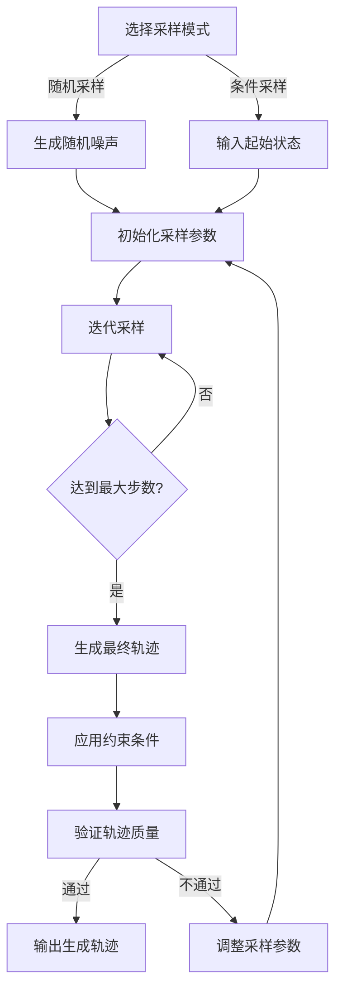

# 【拓】：Diffusion 模型结构、采样策略

## 【拓】阶段概述

【拓】阶段的目标是幻织未境，于合理边界，探索未知之虚。它基于生成模型探索合理的网络边界，生成新颖且合理的极端网络序列，支持随机或条件起始状态，用于探索应用在极端网络条件下的表现。

## Diffusion 模型结构

### Diffusion 模型基础

Diffusion模型是一种生成模型，它通过逐步向数据中添加噪声，然后学习如何逆转这个过程来生成新的数据。对于网络轨迹生成，Diffusion模型可以学习网络参数的分布，并生成符合这种分布的新轨迹。

### 模型结构设计

1. **前向扩散过程**：
   - 逐步向原始网络轨迹添加高斯噪声
   - 经过T步后，轨迹变为完全随机的噪声
   - 前向过程满足：
     $$ q(x_t | x_{t-1}) = \mathcal{N}(x_t; \sqrt{1-\beta_t}x_{t-1}, \beta_t I) $$
     $$ q(x_{1:T} | x_0) = \prod_{t=1}^T q(x_t | x_{t-1}) $$

2. **反向扩散过程**：
   - 学习如何从噪声中恢复原始轨迹
   - 网络架构：U-Net + 注意力机制
   - 时间步嵌入：将时间步信息嵌入到模型中
   - 反向过程满足：
     $$ p_\theta(x_{t-1} | x_t) = \mathcal{N}(x_{t-1}; \mu_\theta(x_t, t), \sigma_\theta^2(x_t, t) I) $$

3. **模型架构**：
   - **输入层**：接收带噪声的网络轨迹和时间步嵌入
   - **U-Net编码器**：提取轨迹的高级特征
   - **注意力机制**：捕捉轨迹的长程依赖关系
   - **U-Net解码器**：从特征中恢复原始轨迹
   - **输出层**：输出去噪后的轨迹

### 模型训练

1. **训练目标**：
   - 最小化预测噪声与真实噪声之间的均方误差
   - 目标函数：
     $$ L = \mathbb{E}_{x_0, \epsilon \sim \mathcal{N}(0,I), t} [||\epsilon - \epsilon_\theta(x_t, t)||^2] $$

2. **训练数据**：
   - 使用【元】单元作为训练数据
   - 包含各种网络状态和场景
   - 数据增强：添加随机噪声、调整时间尺度等

3. **训练策略**：
   - 批量训练：提高训练效率
   - 学习率调度：使用余弦退火学习率
   - 梯度裁剪：防止梯度爆炸

## 采样策略

### 采样目标

- 从噪声中生成新的网络轨迹
- 确保生成的轨迹合理且符合真实网络特性
- 支持条件采样，根据起始状态生成轨迹
- 控制生成轨迹的多样性和真实性

### 采样方法

1. **基础采样**：
   - 从随机噪声开始
   - 逐步应用反向扩散过程
   - 经过T步后生成新的轨迹

2. **条件采样**：
   - 给定起始状态
   - 生成符合该起始状态的轨迹
   - 支持指定目标状态或状态序列

3. **快速采样**：
   - 使用较少的采样步数
   - 提高采样效率
   - 例如：DDIM（Denoising Diffusion Implicit Models）

4. **多样性控制**：
   - 通过调整采样温度控制多样性
   - 温度越高，生成的轨迹越多样
   - 温度越低，生成的轨迹越接近训练数据

### 采样流程

## 质量控制

### 合理边界约束

- **参数范围约束**：确保生成的参数在合理范围内（时延: 0-2000ms, 丢包率: -0.01～1.01）
- **物理规律约束**：确保生成的轨迹符合网络的物理规律
- **状态转换约束**：确保状态转换合理，避免突兀的状态跳变

### 评估指标

- **联合分布**：logp, Mahalanobis距离
- **复合事件**：时延↑ & BW↓等复合事件的合理性
- **GE模型合规**：生成的丢包率序列符合Gilbert-Elliott模型

## 应用场景

- **探索应用在极端网络条件下的表现**
- **发现潜在的网络问题**
- **生成多样化的测试用例**
- **补充稀有网络场景的数据**

## 设计优势

1. **生成能力强**：能够生成复杂的网络轨迹
2. **多样性好**：可以生成多样化的网络场景
3. **可控性高**：支持条件采样和多样性控制
4. **扩展性好**：可以扩展到更多的网络参数和场景
5. **理论基础扎实**：基于坚实的数学理论

## 结论

【拓】阶段的Diffusion模型和采样策略是织虚能够探索未知网络边界的核心。通过精心设计的模型结构和采样策略，织虚能够生成新颖且合理的极端网络序列，为网络应用的测试和验证提供了强大的工具，有助于发现潜在的网络问题和优化空间。