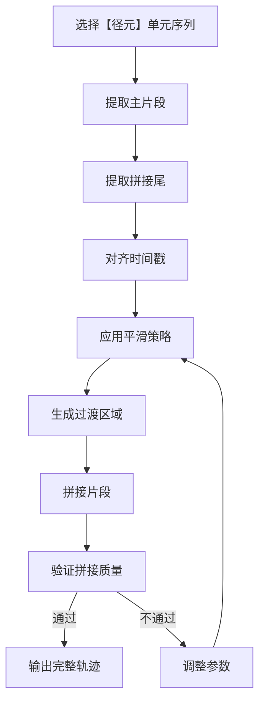

# 重织（重组）：拼接算法、平滑策略

## 重织（重组）阶段概述

重织（重组）阶段的目标是将真实轨迹解构为【径元】丝线，依新【织样】重编，重织多样化的【故径】。它基于真实网络轨迹进行精确回放，所有片段均来自真实观测，无生成内容，用于验证和测试真实网络环境下的应用表现。

## 拼接算法

### 核心目标

- 将多个【径元】单元无缝拼接成完整的网络轨迹
- 保留每个【径元】单元的原始特性
- 减少拼接处的不连续性和突兀感
- 确保生成的轨迹符合物理规律

### 拼接流程

### 拼接策略

1. **顺序拼接**：按照选定的【径元】单元序列顺序拼接
2. **重叠拼接**：使用每个【径元】单元的1秒拼接尾与下一个单元的主片段重叠
3. **时间对齐**：确保所有片段的时间戳正确对齐
4. **质量检查**：对拼接后的轨迹进行质量检查，确保无明显的不连续性

## 平滑策略

### 平滑目标

- 减少拼接处的参数突变
- 保持轨迹的连续性和自然性
- 确保生成的轨迹符合网络的物理特性

### 平滑方法

1. **线性插值**：
   - 在拼接处使用线性插值，使参数从当前值平滑过渡到下一个值
   - 适用于参数变化较为平缓的情况
   - 计算简单，效率高

2. **余弦插值**：
   - 使用余弦函数进行插值，产生更平滑的过渡效果
   - 适用于参数变化较大的情况
   - 过渡更加自然，符合网络参数的实际变化规律

3. **指数平滑**：
   - 对拼接后的轨迹应用指数平滑，减少高频噪声
   - 保留轨迹的主要特性，同时减少不必要的波动
   - 提高轨迹的整体平滑度

4. **PSD约束平滑**：
   - 基于功率谱密度（PSD）约束进行平滑
   - 确保平滑后的轨迹符合原始网络的频谱特性
   - 防止过度平滑导致的信息丢失

### 平滑参数选择

- **平滑窗口大小**：根据网络参数的变化特性选择合适的窗口大小
- **平滑强度**：控制平滑的程度，平衡平滑度和真实性
- **过渡区域长度**：根据拼接处的参数差异调整过渡区域的长度

## 质量评估

### 评估指标

1. **连续性指标**：
   - 计算拼接处的参数变化率
   - 变化率应在合理范围内，避免突变

2. **频谱一致性指标**：
   - 比较拼接前后的功率谱密度
   - 确保频谱特性保持一致

3. **视觉评估**：
   - 可视化拼接后的轨迹
   - 直观检查是否存在明显的不连续性

4. **应用性能评估**：
   - 将拼接后的轨迹注入HoloWAN
   - 运行真实应用，评估应用的QoE

## 优化策略

1. **自适应平滑**：
   - 根据拼接处的参数差异自动调整平滑策略
   - 对差异较小的拼接处使用较弱的平滑
   - 对差异较大的拼接处使用较强的平滑

2. **多策略融合**：
   - 结合多种平滑策略的优点
   - 在不同的拼接处使用不同的平滑方法
   - 提高整体拼接质量

3. **反馈优化**：
   - 基于拼接质量评估结果调整平滑参数
   - 持续优化拼接算法
   - 提高拼接质量的稳定性

## 应用场景

- **复现特定网络环境下的问题**
- **验证应用在真实网络环境下的表现**
- **作为其他编织方式的基础**
- **生成基准测试轨迹**

## 结论

重织（重组）阶段的拼接算法和平滑策略是TraceLoom能够生成高保真网络轨迹的关键。通过精心设计的拼接算法（导数对齐 + 频谱补纹）和平滑策略，TraceLoom能够将多个【径元】单元无缝拼接成完整的网络轨迹，保留原始网络的所有特性和细节，重织出多样化的【故径】。