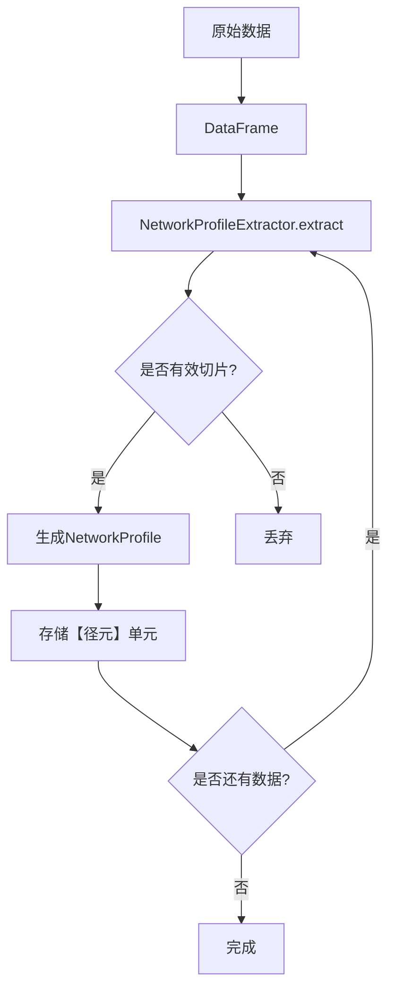

# 【径元】切片逻辑、GMM 聚类细节

## 【径元】的定义

【径元】是TraceLoom中最基本的原子单元，它包含：

- **10秒网络行为片段**：包含时延、丢包率、可用带宽等网络参数
- **GMM状态标签**：使用高斯混合模型对网络状态进行分类（生成【织律】）
- **1秒拼接尾**：用于平滑连接不同的径元单元

状态即语义，贯穿合成全链路。每个径元单元都代表一种特定的网络状态，具有明确的语义含义。

### 核心数据结构

#### NetworkProfile

`NetworkProfile` 是【径元】的核心数据结构，代表一个结构化的网络剖面，包含：

| 类别 | 属性 | 类型 | 说明 | 约束 |
|------|------|------|------|------|
| **基本信息** | `trace_name` | `str` | 轨迹名称 | 必选 |
| | `start_index` | `int` | 起始索引 | 必选 |
| **上下文 (10s)** | `ctx_delay_up` | `List[float]` | 上行时延上下文（毫秒） | 长度=100 |
| | `ctx_loss_up` | `List[float]` | 上行丢包率上下文 | 长度=100, 范围=0-1 |
| | `ctx_bw_up` | `List[float]` | 上行带宽上下文（Mbps） | 长度=100, ≥0 |
| | `ctx_delay_down` | `List[float]` | 下行时延上下文（毫秒） | 长度=100 |
| | `ctx_loss_down` | `List[float]` | 下行丢包率上下文 | 长度=100, 范围=0-1 |
| | `ctx_bw_down` | `List[float]` | 下行带宽上下文（Mbps） | 长度=100, ≥0 |
| **延续 (1s)** | `cont_delay_up` | `List[float]` | 上行时延延续（毫秒） | 长度=10 |
| | `cont_loss_up` | `List[float]` | 上行丢包率延续 | 长度=10, 范围=0-1 |
| | `cont_bw_up` | `List[float]` | 上行带宽延续（Mbps） | 长度=10, ≥0 |
| | `cont_delay_down` | `List[float]` | 下行时延延续（毫秒） | 长度=10 |
| | `cont_loss_down` | `List[float]` | 下行丢包率延续 | 长度=10, 范围=0-1 |
| | `cont_bw_down` | `List[float]` | 下行带宽延续（Mbps） | 长度=10, ≥0 |
| **状态信息** | `is_valid` | `bool` | 是否有效 | 默认为True |
| | `state_id` | `int` | 网络状态ID | 默认为-1 |
| | `state_name` | `str` | 网络状态名称 | 默认为空字符串 |
| | `is_pure` | `bool` | 是否为纯净状态 | 默认为False |
| | `state_proba` | `float` | 状态概率 | 默认为0.0 |
| | `top2_state_ids` | `List[int]` | 概率最高的两个基础状态ID | 默认为空列表 |
| | `top2_state_probas` | `List[float]` | 对应概率 | 默认为空列表 |
| | `base_state_id` | `int` | 主基础状态 | 默认为-1 |

**设计原则**：
- 成对结构：强制要求10s上下文+1s延续，便于监督学习
- 原始数据保留：所有字段直接反映原始网络状态
- 状态属性丰富：支持纯净态/混合态区分、概率值、多状态关联

**示例**：
```python
profile = NetworkProfile(
    trace_name="campus",
    start_index=0,
    ctx_delay_up=[100.5] * 100,  # 10秒上下文
    ctx_loss_up=[0.01] * 100,
    ctx_bw_up=[10.0] * 100,
    ctx_delay_down=[100.5] * 100,
    ctx_loss_down=[0.01] * 100,
    ctx_bw_down=[10.0] * 100,
    cont_delay_up=[100.5] * 10,    # 1秒延续
    cont_loss_up=[0.01] * 10,
    cont_bw_up=[10.0] * 10,
    cont_delay_down=[100.5] * 10,
    cont_loss_down=[0.01] * 10,
    cont_bw_down=[10.0] * 10,
    is_valid=True
)
```

#### ProfileSequence

`ProfileSequence` 用于管理多个相关的 `NetworkProfile`，形成一个完整的网络状态序列：

| 属性 | 类型 | 说明 | 约束 |
|------|------|------|------|
| `sequence_id` | `str` | 序列唯一标识符 | 必选 |
| `profiles` | `List[NetworkProfile]` | 网络剖面列表 | 必选 |
| `metadata` | `Optional[Dict]` | 附加元数据 | 可选 |

**示例**：
```python
sequence = ProfileSequence(
    sequence_id="seq_001",
    profiles=[profile1, profile2, profile3],
    metadata={"created_time": datetime.now().isoformat()}
)
```

## 切片逻辑

### 切片长度选择

- **主片段长度**：10秒
  - 选择理由：足够长以包含网络状态的主要特性，同时足够短以保持状态的相对稳定性
  - 能够捕捉到网络的典型行为模式
  - 便于后续的聚类和生成操作

- **拼接尾长度**：1秒
  - 选择理由：足够长以实现平滑过渡，同时不会过度影响整体轨迹
  - 用于连接不同的径元单元，减少拼接处的不连续性
  - 包含网络状态从当前状态过渡到下一个状态的过程

### 切片策略

1. **滑动窗口切片**：使用10秒的滑动窗口对原始数据进行切片
2. **重叠切片**：相邻切片之间有1秒的重叠，用于生成拼接尾
3. **边界处理**：对数据的开始和结束部分进行特殊处理，确保所有数据都能被充分利用
4. **异常处理**：跳过明显异常的切片，如包含大量缺失值或极端值的切片

### 切片流程



### 切片实现细节

切片功能由 `NetworkProfileExtractor` 类实现，核心参数：

| 参数 | 默认值 | 说明 |
|------|--------|------|
| `window_context_size` | 100 | 上下文窗口大小（行） |
| `window_cont_size` | 10 | 延续窗口大小（行） |
| `sliding_step` | 50 | 滑动步长（行） |

#### 窗口有效性检查

`_is_valid_window` 方法检查窗口是否有效，无效条件：
- 延迟 > 2000ms（原始空间）
- 上行或下行存在连续 ≥10 个相等延迟（原始空间）

### 16维特征提取算法

从 NetworkProfile 中提取 16 维特征向量，用于后续聚类，每方向（上行/下行）8 个特征：

#### 延迟特征（4个/方向）

1. **延迟对数均值**：`mean(log(1 + delay))`
2. **延迟对数标准差**：`std(log(1 + delay))`
3. **延迟对数 P95**：`percentile(log(1 + delay), 95)`
4. **延迟对数最大值**：`max(log(1 + delay))`

#### 丢包特征（4个/方向）

1. **是否有丢包**：`1.0 if any(loss > 0) else 0.0`
2. **条件丢包均值**：`mean(loss[loss > 0])`（仅当有丢包时）
3. **丢包比例**：`sum(loss > 0) / 100.0`
4. **丢包均值**：`mean(loss)`

**示例特征向量结构**：
```
[up_delay_mean, up_delay_std, up_delay_p95, up_delay_max,
 up_has_loss, up_cond_loss_mean, up_loss_ratio, up_loss_mean,
 down_delay_mean, down_delay_std, down_delay_p95, down_delay_max,
 down_has_loss, down_cond_loss_mean, down_loss_ratio, down_loss_mean]
```

## GMM 聚类细节

### 聚类目标

- 将相似的网络片段归类到同一状态
- 为每个片段分配一个明确的状态标签
- 每个状态代表一种特定的网络行为模式

### GMM 模型选择

- **模型类型**：高斯混合模型（Gaussian Mixture Model）
- **优势**：
  - 能够处理连续数据
  - 支持软聚类，每个数据点可以属于多个聚类
  - 具有良好的数学基础和可解释性
  - 能够捕捉数据的概率分布

### 特征选择

- **时延**：往返时间，反映网络延迟
- **丢包率**：数据包丢失的比例，反映网络可靠性
- **可用带宽**：网络能够提供的最大带宽，反映网络容量

### 模型训练

1. **数据预处理**：
   - 归一化：将特征值缩放到相同的范围
   - 去噪：去除明显的噪声和异常值
   - 特征工程：根据需要生成新的特征

2. **模型参数选择**：
   - 聚类数量：通过AIC/BIC准则自动选择最优的聚类数量
   - 协方差类型：根据数据特性选择合适的协方差类型（如full、tied、diag、spherical）
   - 初始化方法：使用k-means++进行初始化，提高模型的收敛速度和质量

3. **训练过程**：
   - 使用EM算法估计模型参数
   - 迭代直到收敛或达到最大迭代次数
   - 验证模型性能，确保聚类结果合理

### 特征工程

#### 16维特征提取

特征提取是聚类的关键步骤，从网络剖面中提取16维特征向量，用于后续的聚类操作。

**实现位置**：`src/traceloom/simcore/pathlet/features.py`

**核心函数**：
- `extract_16d_features(profile)`: 从单个网络剖面中提取16维特征
- `extract_features_batch(profiles)`: 批量从网络剖面中提取16维特征
- `NetworkProfile.extract_features()`: 网络剖面对象的方法，直接提取特征

**特征向量结构**：
```
[up_delay_mean, up_delay_std, up_delay_p95, up_delay_max,
 up_has_loss, up_cond_loss_mean, up_loss_ratio, up_loss_mean,
 down_delay_mean, down_delay_std, down_delay_p95, down_delay_max,
 down_has_loss, down_cond_loss_mean, down_loss_ratio, down_loss_mean]
```

### GMMClusterer 实现细节

GMM聚类功能由 `GMMClusterer` 类实现，核心流程：

1. **特征提取与缩放**：
   ```mermaid
   flowchart TD
       A[NetworkProfile] --> B[extract_16d_features]
       B --> C[RobustScaler.transform]
       C --> D[GMM.predict_proba]
   ```

2. **核心参数**：
   | 参数 | 默认值 | 说明 |
   |------|--------|------|
   | `n_components` | 3 | 聚类数量 |
   | `confidence_threshold` | 0.85 | 纯净态置信度阈值 |
   | `random_state` | 42 | 随机种子 |

### 状态体系设计

#### 纯净态与混合态

| 状态类型 | 定义 | 条件 | 示例 |
|----------|------|------|------|
| **纯净态** | 单一基础状态，置信度高 | 主状态概率 ≥ θ（默认0.85） | `stable` |
| **混合态** | 两个基础状态的组合 | 主状态概率 < θ | `jittery/abnormal` |

#### 状态命名规则

- **基础状态名称**：
  - 0: `stable`（稳定）
  - 1: `jittery`（抖动）
  - 2: `abnormal`（异常）

- **混合态命名**：按字典序组合两个基础状态名称，如 `jittery/abnormal`

#### 状态ID映射

| 状态类型 | 数量 | 示例 | state_id |
|----------|------|------|----------|
| 纯净态 | K | `stable` | 0 |
| | | `jittery` | 1 |
| | | `abnormal` | 2 |
| 混合态 | C(K,2) | `jittery/abnormal` | 3 |
| | | `stable/abnormal` | 4 |
| | | `stable/jittery` | 5 |
| **总状态数** | K + C(K,2) | - | 6（当K=3时） |

### 状态元数据管理

`StateNamer` 类负责管理状态元数据，包括：

```json
{
  "algorithm": "gmm",
  "n_components": 3,
  "confidence_threshold": 0.85,
  "states": [
    {
      "state_id": 0,
      "state_name": "stable",
      "type": "pure",
      "base_states": [0],
      "color": "#4CAF50"
    },
    {
      "state_id": 3,
      "state_name": "jittery/abnormal",
      "type": "mixed",
      "base_states": [1, 2],
      "color": "#FB8C00"
    }
  ],
  "created_at": "2026-01-25T10:00:00Z"
}
```

### 聚类结果评估

- **内部评估指标**：AIC、BIC、Silhouette系数、Davies-Bouldin指数
- **外部评估指标**：如果有标注数据，可以使用纯度、归一化互信息等指标
- **可视化评估**：通过t-SNE可视化聚类结果，直观判断聚类质量
- **领域知识评估**：结合网络领域知识，评估聚类结果的合理性

### t-SNE可视化实现

#### TSNEVisualizer 功能

`t-SNE` 可视化功能由 `TSNEVisualizer` 类实现，用于将高维网络状态特征映射到二维空间，便于直观观察聚类效果。

#### 核心参数

| 参数 | 默认值 | 说明 |
|------|--------|------|
| `perplexity` | 20 | t-SNE perplexity参数，影响局部与全局结构平衡 |
| `early_exaggeration` | 10.0 | 早期夸张参数，影响簇分离效果 |
| `learning_rate` | 200.0 | 学习率，影响收敛速度 |
| `random_state` | 42 | 随机种子 |

#### 可视化优化策略

| 优化项 | 策略 | 效果 |
|--------|------|------|
| **大规模数据** | 样本数量 > 2000 时进行抽样 | 提高渲染速度 |
| **状态区分** | 纯净态使用圆形，混合态使用正方形 | 直观区分状态类型 |
| **置信度表示** | 透明度 = min(1.0, 概率 * 1.2) | 可视化置信度 |
| **混合态标记** | 混合态添加灰色边框 | 增强混合态识别 |
| **t-SNE 加速** | 使用 `method="barnes_hut"` 和 `angle=0.3` | 提高计算速度 |

#### 可视化输出

1. **基本可视化**：
   - 颜色映射：基于状态ID
   - 形状区分：纯净态/混合态
   - 透明度：表示置信度
   - 输出路径：`settings.OUTPUT_DIR / clustering_gmm_tsne_*.png`

2. **带注释的可视化**：
   - 每50个点添加索引注释
   - 便于调试和分析
   - 输出路径：`settings.OUTPUT_DIR / clustering_gmm_tsne_annotated_*.png`

## 【径元】单元的应用

### 作为织径的基本单元

所有的织径模式（重织、绣织、广织）都基于【径元】单元进行操作。【径元】单元提供了结构化的网络状态表示，便于后续的生成和拼接操作。

### 作为状态转移的基础

【径元】单元的状态标签为状态转移提供了基础。不同的织径模式可以基于状态标签进行状态转移和生成，确保生成的轨迹具有合理的状态变化。

### 作为验证的参考

【径元】单元的原始片段可以作为验证生成轨迹的参考。通过比较生成轨迹与原始【径元】单元的差异，可以评估生成轨迹的真实性和可信度。

## 设计优势

1. **模块化**：【径元】单元提供了模块化的网络状态表示，便于组合和扩展
2. **语义化**：状态标签赋予了网络片段明确的语义含义，便于理解和使用
3. **可扩展性**：支持添加新的特征和状态类型，适应不断变化的网络环境
4. **高效性**：基于【径元】单元的操作可以提高生成效率，减少计算复杂度
5. **可解释性**：生成的轨迹可以通过状态标签进行解释，便于理解和调试

## 结论

【径元】单元是TraceLoom的核心设计之一，它将原始的网络数据转化为结构化、语义化的单元，为后续的织径操作提供了基础。切片逻辑和GMM聚类是生成【径元】单元的关键技术，它们确保了【径元】单元的质量和可靠性。