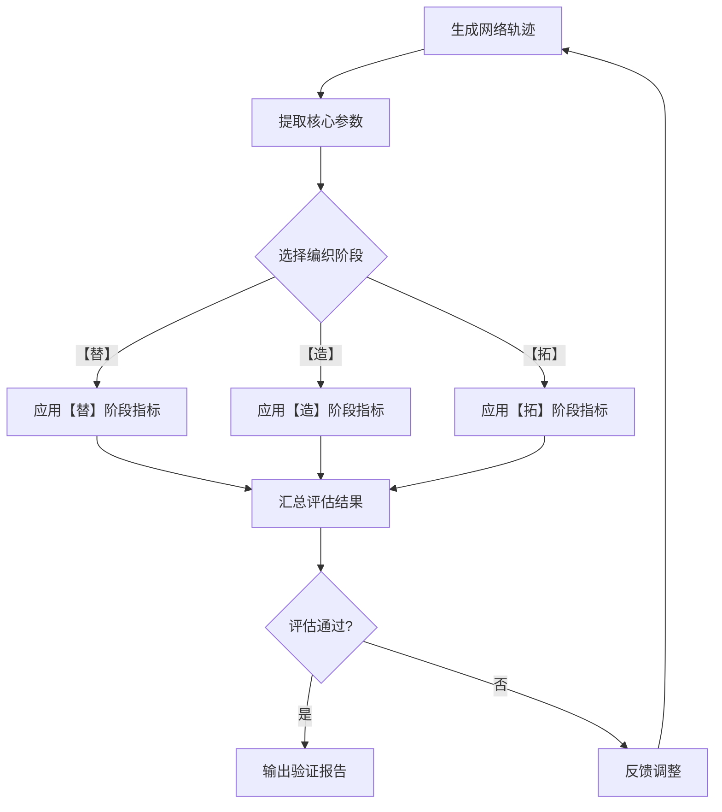

# 时延/丢包率/可用带宽 各阶段评估指标定义

## 评估体系概述

织虚采用多维度的评估体系，对生成的网络轨迹进行全面验证。评估体系涵盖了时延（往返时间）、Loss（丢包率）、BW（可用带宽）三个核心网络参数，以及不同编织阶段（【替】、【造】、【拓】）的特定指标。

## 核心评估维度

### 1. 时延 评估指标

#### 【替】阶段评估

- **ACF（自相关函数）对齐**：
  - 评估生成轨迹的自相关函数与真实轨迹的相似度
  - 指标：ACF曲线的均方误差（MSE）
  - 要求：MSE ≤ 0.1

- **PSD（功率谱密度）对齐**：
  - 评估生成轨迹的频谱特性与真实轨迹的相似度
  - 指标：PSD曲线的KL散度
  - 要求：KL散度 ≤ 0.5

- **Jitter（抖动）保留**：
  - 评估生成轨迹是否保留了原始轨迹的抖动特性
  - 指标：抖动的统计特征（均值、方差）
  - 要求：统计特征差异 ≤ 10%

#### 【造】阶段评估

- **Jitter保留**：
  - 与【替】阶段相同

- **平滑度**：
  - 评估生成轨迹的平滑度
  - 指标：时延变化率的最大值
  - 要求：变化率 ≤ 100 ms/s

#### 【拓】阶段评估

- **合理性**：
  - 评估生成轨迹的合理性
  - 指标：时延值在合理范围内（0-2000ms）
  - 要求：100%的数据点在范围内

- **联合分布一致性**：
  - 评估时延与其他参数（Loss、BW）的联合分布
  - 指标：logp值、Mahalanobis距离
  - 要求：logp ≥ -10，Mahalanobis距离 ≤ 5

### 2. Loss 评估指标

#### 【替】阶段评估

- **Burstiness（突发性）保留**：
  - 评估生成轨迹是否保留了原始轨迹的丢包突发性
  - 指标：丢包事件的间隔分布
  - 要求：分布差异 ≤ 15%

- **GE（Gilbert-Elliott）模型合规**：
  - 评估生成轨迹是否符合GE模型
  - 指标：GE模型参数拟合度
  - 要求：拟合度 ≥ 0.9

#### 【造】阶段评估

- **GE模型合规**：
  - 与【替】阶段相同

- **丢包率范围**：
  - 评估生成轨迹的丢包率是否在合理范围内
  - 指标：丢包率值在[-0.01, 1.01]范围内
  - 要求：100%的数据点在范围内

#### 【拓】阶段评估

- **GE模型合规**：
  - 与【替】阶段相同，要求适当放宽
  - 要求：拟合度 ≥ 0.8

- **复合事件合理性**：
  - 评估时延↑ & BW↓等复合事件中丢包率的表现
  - 指标：复合事件中丢包率的统计特征
  - 要求：符合预期网络行为

### 3. BW 评估指标

#### 【替】阶段评估

- **CV（变异系数）匹配**：
  - 评估生成轨迹的带宽变异系数与真实轨迹的相似度
  - 指标：CV值差异
  - 要求：差异 ≤ 10%

- **PSD对齐**：
  - 评估生成轨迹的带宽频谱特性与真实轨迹的相似度
  - 指标：PSD曲线的KL散度
  - 要求：KL散度 ≤ 0.5

#### 【造】阶段评估

- **轨迹RMSE + 加速度**：
  - 评估生成轨迹的准确性和平滑度
  - 指标：RMSE + 加速度值
  - 要求：≤ 20 Mbps/s

- **带宽范围**：
  - 评估生成轨迹的带宽是否在合理范围内
  - 指标：带宽值的合理性
  - 要求：符合预期网络场景

#### 【拓】阶段评估

- **联合分布一致性**：
  - 评估BW与其他参数（时延、Loss）的联合分布
  - 指标：logp值、Mahalanobis距离
  - 要求：logp ≥ -10，Mahalanobis距离 ≤ 5

- **极端值合理性**：
  - 评估生成轨迹中极端带宽值的合理性
  - 指标：极端值的出现频率和持续时间
  - 要求：符合网络的物理规律

## 评估流程

## 验证报告示例

| 维度 | 指标 | 【替】阶段 | 【造】阶段 | 【拓】阶段 |
|------|------|------------|------------|------------|
| 时延 | ACF对齐 | MSE ≤ 0.1 | - | - |
| 时延 | PSD对齐 | KL ≤ 0.5 | - | - |
| 时延 | Jitter保留 | 差异 ≤ 10% | 差异 ≤ 10% | - |
| 时延 | 合理性 | - | - | 100%在范围内 |
| Loss | Burstiness保留 | 差异 ≤ 15% | - | - |
| Loss | GE模型合规 | 拟合度 ≥ 0.9 | 拟合度 ≥ 0.9 | 拟合度 ≥ 0.8 |
| Loss | 范围 | - | 100%在范围内 | 100%在范围内 |
| BW | CV匹配 | 差异 ≤ 10% | - | - |
| BW | PSD对齐 | KL ≤ 0.5 | - | - |
| BW | RMSE + 加速度 | - | ≤ 20 Mbps/s | - |
| 联合 | logp值 | - | - | ≥ -10 |
| 联合 | Mahalanobis距离 | - | - | ≤ 5 |

## 最佳实践

1. **针对性评估**：根据编织阶段选择合适的评估指标
2. **多维度验证**：从多个角度对轨迹进行全面评估
3. **持续优化**：根据评估结果持续调整生成参数
4. **结合应用测试**：最终以"闭卷考试"验证为准

## 结论

织虚的多维度评估体系确保了生成的网络轨迹具有高度的真实性和可信度。通过对时延、Loss、BW三个核心参数的全面评估，以及不同编织阶段的特定指标，织虚能够生成符合真实网络特性的轨迹，为网络应用的测试和验证提供可靠的基础。