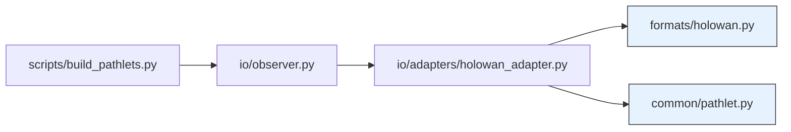

# 🧵 TraceLoom HoloWAN 模块重构方案（V3.4）

> **目标**：职责清晰、扩展性强、符合“格式-适配-入口”三层架构  
> **原则**：格式规范与业务逻辑分离，适配器作为唯一转换点

---

## 一、原始类清单 vs 新结构归属

| 原文件 | 原类/功能 | 新位置 | 状态 | 说明 |
|--------|----------|--------|------|------|
| `holowan.py` | `HoloWANDataPoint` | `src/traceloom/formats/holowan.py` | ✅ **保留（重命名字段）** | 改为 `up: HoloWANDirection`, `down: HoloWANDirection` |
| `holowan.py` | `HoloWANWindow` | **移除** | ❌ 删除 | 未在核心流程使用，属冗余抽象 |
| `holowan.py` | `HoloWANFile` | `src/traceloom/formats/holowan.py` | ✅ **保留** | 仅含 `load()` / `save()` 静态方法 |
| `holowan.py` | `HoloWANLoader` | **移入 `scripts/`（如需）** | ⚠️ 可选 | 批量加载属训练流程，非格式本身 |
| `holowan.py` | `HoloWANWriter`（写 Parquet） | **删除** | ❌ 删除 | 径元库由 `PathletStore` 统一管理 |
| `holowan.py` | `HoloWANManager`（设备交互） | **移出项目** | ❌ 删除 | 与离线轨迹生成无关，可独立为 `traceloom-device` |
| `holowan_adapter.py` | `HoloWANAdapter` | `src/traceloom/io/adapters/holowan_adapter.py` | ✅ **保留 + 增强** | 负责 `HoloWANFile` ↔ `Observation` 转换 |
| （隐含） | `Observation`（原含 `rtt1/rtt2`） | `src/traceloom/common/pathlet.py` | ✅ **更新字段** | `delay_up`, `delay_down`, `loss_up`... |

> 🔑 **关键决策**：
> - **仅保留与“文件格式解析”直接相关的类**
> - **所有业务语义（如 `delay_up`）在适配器层注入**
> - **批量操作、设备控制、Parquet 写入等移出格式模块**

---

## 二、新增目录与文件

| 路径 | 文件 | 职责 |
|------|------|------|
| `src/traceloom/formats/` | `holowan.py` | **HoloWAN 格式事实标准**• 无任何 TraceLoom 依赖• 可被外部项目复用 |
| `src/traceloom/io/adapters/` | `holowan_adapter.py` | **双向适配器**• `HoloWANFile` → `List[Observation]`• 字段映射（上行/下行）在此完成 |
| `src/traceloom/common/` | `pathlet.py` | **共享数据结构**• `Observation`, `BodyObservations` 等• 推理与训练共用 |

> 💡 **为什么新增 `formats/` 和 `adapters/`？**  
> - 符合 **关注点分离**（Separation of Concerns）  
> - 未来支持 Wireshark/PCAP 时，只需新增 `formats/pcap.py` + `adapters/pcap_adapter.py`

---

## 三、最终目录结构（完整）

```bash
TraceLoom/
│
├── src/
│   └── traceloom/
│       ├── common/                    # ← 共享数据结构（原在 training/）
│       │   └── pathlet.py             # Observation, Pathlet, BodyObservations...
│       │
│       ├── formats/                   # ← 新增：外部格式规范
│       │   └── _holowan.py             # HoloWANDataPoint, HoloWANFile（纯格式）
│       │
│       ├── io/
│       │   ├── adapters/              # ← 新增：格式适配器
│       │   │   └── holowan_adapter.py # HoloWAN ↔ Observation 转换
│       │   ├── __init__.py
│       │   └── observer.py            # 统一入口：Observer.parse_file()
│       │
│       ├── core/
│       │   └── config.py              # OBSERVATION_FIELDS = ("delay_up", ...)
│       │
│       └── weaving/                   # （不变）
│
├── scripts/                           # 训练脚本（不进 PyPI）
│   ├── build_pathlets.py              # 使用 Observer.parse_file()
│   └── ...
│
├── training/                          # （可选保留，或清空）
│   └── ...                            # 建议：训练专用模型细节（如 GMM 封装）
│
└── data/
    └── raw/                           # 原始 .txt 文件（HoloWAN 格式）
```

---

## 四、各模块依赖关系



> 🔒 **依赖约束**：
> - `formats/` **不能 import** `traceloom` 任何其他模块
> - `adapters/` 是 **唯一连接 `formats/` 与 `common/` 的桥梁**

---

## 五、迁移 checklist

- [ ] 创建 `src/traceloom/formats/` 和 `src/traceloom/io/adapters/`
- [ ] 将 `holowan.py` 中的 `HoloWANDataPoint` / `HoloWANFile` 移至 `formats/holowan.py`
- [ ] 删除 `HoloWANWindow` / `HoloWANWriter` / `HoloWANManager`
- [ ] 更新 `holowan_adapter.py` 的 import 路径和字段映射（`delay_up` 等）
- [ ] 将 `training/common/pathlet.py` 移至 `src/traceloom/common/pathlet.py`
- [ ] 更新 `scripts/` 中的 import 语句（使用 `Observer.parse_file()`）
- [ ] 更新 `core/config.py` 中的 `OBSERVATION_FIELDS`

---

## ✅ 优势总结

| 维度 | 改进效果 |
|------|--------|
| **架构清晰度** | 格式、适配、入口三层解耦，职责单一 |
| **可维护性** | 修改 HoloWAN 格式只需动 `formats/`，不影响业务 |
| **可扩展性** | 加新数据源只需新增两个文件 |
| **测试友好** | `formats/` 可独立单元测试 |
| **术语一致性** | 全栈使用 `delay_up`/`delay_down`，方向明确 |

---

> 🧵 **观元为始，主干载态，融尾续脉，径元成丝**  
> **织律识态，织样编序，三重织径，虚实无痕**