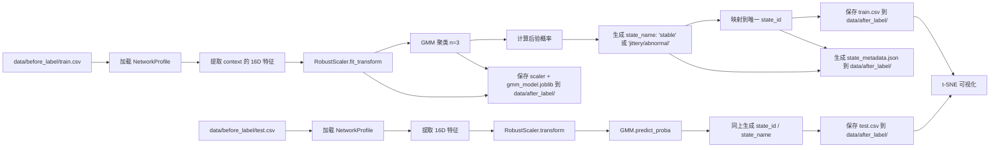

# 🧠 TraceLoom 网络状态聚类与可视化增强方案  
> **版本**：v1.0 · 2026年1月  
> **目标**：基于训练集中的 `NetworkProfile.context`（10秒窗口），通过 GMM 聚类自动发现网络状态，为每个“元”分配全局唯一的 `state_id`（含纯净态与混合态），并提供可解释名称、置信度、t-SNE 可视化支持，输出结构化结果供标注与建模使用。

---

## 一、核心原则

| 原则 | 说明 |
|------|------|
| ✅ **语义完备** | 区分纯净状态（如 `"stable"`）与混合状态（如 `"jittery/abnormal"`） |
| ✅ **ID 唯一** | 每个语义状态有独立整数 `state_id`（非仅主簇编号） |
| ✅ **概率驱动** | 基于 GMM 后验概率，支持置信度过滤（默认 θ=0.85） |
| ✅ **无数据泄露** | 所有模型（`RobustScaler` + GMM）仅在训练集拟合 |
| ✅ **测试集对齐** | 测试集通过 GMM 预测获得一致 `state_id` |
| ✅ **工程解耦** | 聚类逻辑归属 `simcore/pathlet/`，流水线由 `pipelines/clustering.py` 编排 |
| ✅ **人工友好** | 中间数据用 CSV，可视化用 t-SNE（清晰展示簇分离） |

---

## 二、整体流程



---

## 三、关键输出

### 1. 增强版 CSV（`train.csv`, `test.csv`）

在原始 `NetworkProfile` 字段基础上，新增：

| 字段 | 类型 | 说明 |
|------|------|------|
| `state_id` | int32 | 全局唯一状态 ID（0~5） |
| `state_name` | string | 可读名称（如 `"jittery/abnormal"`） |
| `is_pure` | bool | 是否为高置信纯净状态（`proba ≥ 0.85`） |
| `state_proba` | float32 | 主状态后验概率 |
| `top2_state_ids` | list[int32] | 概率最高的两个基础状态 ID |
| `top2_state_probas` | list[float32] | 对应概率 |
| `base_state_id` | int32 | 主基础状态（用于兼容颜色映射） |

> 🔸 文件格式：CSV（便于人工检查）  
> 🔸 保留所有原始 `ctx_*` / `cont_*` 字段

---

### 2. 元数据文件（`state_metadata.json`）

```json
{
  "algorithm": "gmm",
  "n_components": 3,
  "confidence_threshold": 0.85,
  "states": [
    {
      "state_id": 0,
      "state_name": "stable",
      "type": "pure",
      "base_states": [0],
      "color": "#4CAF50"
    },
    {
      "state_id": 3,
      "state_name": "jittery/abnormal",
      "type": "mixed",
      "base_states": [1, 2],
      "color": "#FB8C00"
    }
    // ... 其他状态
  ],
  "created_at": "2026-01-25T10:00:00Z"
}
```

📌 用途：前端渲染、API 返回、人工审核依据

---

### 3. 可视化图（t-SNE）

- **算法**：`sklearn.manifold.TSNE`
- **参数**：
  - `perplexity=30`
  - `early_exaggeration=12.0`
  - `learning_rate="auto"`
  - `init="pca"`
  - `random_state=42`
- **着色规则**：
  - 填充色：按 `state_metadata[state_id]["color"]`
  - 边框：混合态加灰色细边框
  - 透明度：`alpha = min(1.0, state_proba * 1.2)`
- **输出路径**：`data/after_label/clustering_gmm_tsne.png`

> ✅ t-SNE 更强调**局部簇分离**，适合展示 GMM 聚类效果

---

## 四、状态体系（默认 K=3）

| state_id | state_name | 类型 | 基础状态组合 |
|----------|------------|------|--------------|
| 0 | `"stable"` | 纯净 | [0] |
| 1 | `"jittery"` | 纯净 | [1] |
| 2 | `"abnormal"` | 纯净 | [2] |
| 3 | `"jittery/abnormal"` | 混合 | [1, 2] |
| 4 | `"stable/abnormal"` | 混合 | [0, 2] |
| 5 | `"stable/jittery"` | 混合 | [0, 1] |

- 总状态数 = K + C(K,2) = 6  
- 混合状态按字典序命名，确保确定性

---

## 五、特征工程（16维）

**输入**：`NetworkProfile.context`（100 行原始值）  
**方向**：上行（up） + 下行（down） → 8×2 = 16 维

#### 延迟特征（每方向）
- `delay_log_mean` = mean(log(1 + raw_delay))
- `delay_log_std`
- `delay_log_p95`
- `delay_log_max`

#### 丢包特征（每方向）
- `has_loss` = 1 if any(loss > 0) else 0
- `cond_loss_mean` = mean(loss[loss > 0]) or 0.0
- `loss_ratio` = sum(loss > 0) / 100.0
- `loss_mean` = mean(loss)

> 🔸 **必须使用 `raw_*` 字段**（即使已归一化）  
> 🔸 实现位置：`src/traceloom/simcore/pathlet/features.py::extract_16d_features()`

---

## 六、模块实现路径

| 功能 | 路径 |
|------|------|
| GMM 聚类器 | `src/traceloom/simcore/pathlet/cluster.py` |
| 状态命名与 ID 映射 | `src/traceloom/simcore/pathlet/namer.py` |
| 特征提取 | `src/traceloom/simcore/pathlet/features.py` |
| t-SNE 可视化 | `src/traceloom/simcore/pathlet/visualizer.py` |
| 聚类流水线 | `src/traceloom/pipelines/clustering.py` |
| CLI 入口 | `scripts/run_clustering.py` |

> 🔸 聚类作为“元”的衍生属性，归属 `pathlet/` 模块

---

## 七、使用方式

```bash
# 默认运行（GMM 3类，θ=0.85，t-SNE 可视化）
uv run python scripts/run_clustering.py --assign-test-states

# 自定义置信度阈值
uv run python scripts/run_clustering.py --confidence-threshold 0.8
```

脚本调用 `pipelines.clustering.run()`，自动完成：
1. 加载 train/test CSV
2. 特征提取 + 归一化
3. GMM 聚类 + 状态分配
4. 生成增强 CSV + JSON + PNG

---

## 八、下游应用

| 场景 | 使用方式 |
|------|--------|
| 初始标注 | 优先使用 `is_pure=True` 的样本 |
| 模型训练 | 以 `state_id` 为 6 分类标签 |
| 状态监控 | 统计 `state_name` 分布，告警 `"abnormal/*"` |
| 人工审核 | 按 `state_name` 分组查看波形 |
| API 服务 | 返回 `{ "state_id": 3, "state_name": "jittery/abnormal", "confidence": 0.62 }` |

---

## 九、优势总结

- **语义清晰**：纯净 vs 混合一目了然  
- **ID 唯一**：支持高效存储与模型训练  
- **概率透明**：置信度可用于过滤或加权  
- **可视化直观**：t-SNE + 颜色 + 边框 + 透明度多维表达  
- **工程完备**：输出 CSV + JSON + PNG，开箱即用  
- **架构统一**：聚类作为“元”的属性，归属 `pathlet/`，由 `pipelines/` 编排  

---

> **织虚之道，始于元，成于态。**  
> 此方案将原始日志转化为**可理解、可操作、可验证**的网络状态知识，为 TraceLoom 的三重织境（替、造、拓）奠定语义基石。

---  
**附：目录结构快照（相关部分）**
```text
src/traceloom/
├── simcore/pathlet/
│   ├── profile.py          # NetworkProfile 定义
│   ├── extractor.py        # 特征提取
│   ├── cluster.py          # GMM 聚类
│   ├── namer.py            # state_id / state_name 映射
│   └── visualizer.py       # t-SNE 可视化
├── pipelines/
│   └── clustering.py       # 端到端流水线
scripts/
└── run_clustering.py       # CLI 入口
```
