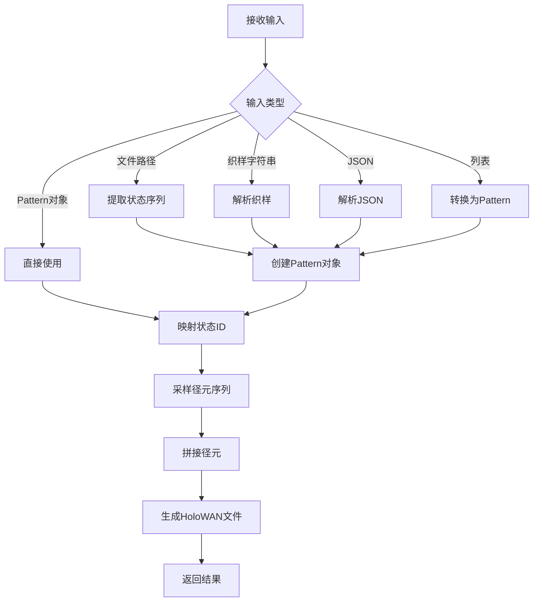

# 🧵 TraceLoom · 重织（Reweave）模块详细设计文档  
> **版本**：1.0  
> **目标**：将任意形式的状态指令，通过全局【径元】库，重建为高保真、物理合理的 6 列 HoloWAN 虚拟轨迹

---

## 一、模块职责

| 职责 | 说明 |
|------|------|
| ✅ **统一输入解析** | 接收文件路径、织样字符串、JSON 列表，统一转为 `Pattern` 对象 |
| ✅ **状态 ID 映射** | 将 `Pattern` 中的 `"s0"` 等状态名映射为整型 `state_id` |
| ✅ **全局径元调度** | 根据 `(state_id, duration)` 从全局库采样真实【径元】ID 序列 |
| ✅ **调用拼接引擎** | 触发 6 维安全拼接，生成合成轨迹 |
| ❌ **不负责** | 文件读写、HoloWAN header 处理、特征工程、GMM 预测 |

---

## 二、输入规范

### 2.1 输入类型（支持 5 种）

| 类型 | 格式 | 示例 | 目标 |
|------|------|------|------|
| **文件路径** | 字符串 | `"path/to/file.txt"` | 从真实文件提取【织样】 |
| **织样字符串** | 字符串 | `"s0x2 -> s2x3"` | 直接使用用户指定【织样】 |
| **JSON 列表** | 字符串 | `'[{"state": "s0", "duration": 20}, {"state": "s2", "duration": 30}]'` | 支持结构化输入 |
| **Python 字典列表** | 列表 | `[{"state": "s0", "duration": 20}]` | 支持程序内调用 |
| **Pattern 对象** | 对象 | `Pattern(sequence=[("s0", 20), ("s2", 30)])` | 支持高级定制 |

### 2.2 织样格式（核心）

`"s0x2 -> s2x3"` 解析规则：
- `s0`：状态名（`s` + 状态 ID）
- `x2`：时长倍数（`x` + 倍数），实际时长 = 倍数 × 10 秒
- `->`：状态分隔符

### 2.3 JSON 格式

```json
[
  {"state": "s0", "duration": 20},   // 状态 s0 持续 20 秒
  {"state": "s2", "duration": 30}    // 状态 s2 持续 30 秒
]
```

## 三、输出规范

### 3.1 返回值结构

```python
{
    "path_id": "tl_20240126_143022",  // 生成的路径唯一标识符
    "duration_sec": 50,                // 路径总时长（秒）
    "state_sequence": "s0x2 -> s2x3"   // 规范化的状态序列
}
```

### 3.2 输出文件格式

输出标准 HoloWAN `.txt` 文件，包含：
- 完整的 HoloWAN header
- `# State Sequence: s0x2 -> s2x3` 注释行
- 6 列数据：`delay1,loss1,bw1,delay2,loss2,bw2`

---

## 四、核心流程



---

## 五、数据结构设计

### 5.1 Pattern 类

```python
class Pattern:
    def __init__(self, sequence: List[Tuple[str, int]]):
        self.sequence = sequence  # 格式：[(state_name, duration_sec), ...]
    
    @classmethod
    def from_string(cls, s: str) -> "Pattern":
        # 解析 "s0x2 -> s2x3" 格式
        pass
    
    @classmethod
    def from_json(cls, data: List[Dict[str, Any]]) -> "Pattern":
        # 解析 JSON 格式
        pass
    
    def to_string(self) -> str:
        # 转换为紧凑字符串格式
        pass
    
    def to_json(self) -> List[Dict[str, Any]]:
        # 转换为 JSON 格式
        pass
    
    def validate(self) -> bool:
        # 验证 Pattern 的有效性
        pass
```

### 5.2 PathletInfo 类

```python
class PathletInfo:
    def __init__(self, pathlet_id: int, state_id: int, trace_name: str, start_index: int):
        self.pathlet_id = pathlet_id  # 径元唯一 ID
        self.state_id = state_id      # 状态 ID
        self.trace_name = trace_name  # 原始轨迹名称
        self.start_index = start_index  # 原始轨迹起始索引
```

---

## 六、核心组件与依赖

| 组件 | 类型 | 作用 | 位置 |
|------|------|------|------|
| Pattern | 类 | 【织样】数据结构与解析 | `simcore/pattern.py` |
| NetworkSplicer | 类 | 6 维径元拼接引擎 | `simcore/reweave/reweaver.py` |
| PathletStorage | 类 | 【径元】库存储与查询 | `io/pathlet_storage.py` |
| GMMClusterer | 类 | 状态识别与映射 | `simcore/pathlet/cluster.py` |

---

## 七、接口设计

### 7.1 外部调用接口

```python
def reweave(
    input: Union[str, list, Pattern],  # 支持 5 种输入类型
    output_file: Union[str, Path] = "output.txt"  # 输出文件路径
) -> Dict[str, Any]:  # 返回结果字典
    """重织核心接口，将输入转换为合成轨迹
    
    Args:
        input: 支持文件路径、织样字符串、JSON、列表、Pattern 对象
        output_file: 输出文件路径，默认为 "output.txt"
    
    Returns:
        包含路径信息的字典
    """
    # 实现逻辑
```

### 7.2 内部调用接口

#### 7.2.1 parse_input

```python
def parse_input(input: Any) -> Pattern:
    """解析输入，转换为 Pattern 对象
    
    Args:
        input: 输入数据
    
    Returns:
        Pattern 对象
    
    Raises:
        ValidationError: 输入格式无效
    """
```

#### 7.2.2 map_state_names_to_ids

```python
def map_state_names_to_ids(pattern: Pattern) -> Pattern:
    """将状态名映射为状态 ID
    
    Args:
        pattern: 包含状态名的 Pattern 对象
    
    Returns:
        包含状态 ID 的 Pattern 对象
    """
```

#### 7.2.3 sample_pathlets

```python
def sample_pathlets(pattern: Pattern, pathlet_storage: PathletStorage) -> List[PathletInfo]:
    """根据 Pattern 采样径元序列
    
    Args:
        pattern: Pattern 对象
        pathlet_storage: 径元存储实例
    
    Returns:
        径元信息列表
    """
```

#### 7.2.4 generate_trace

```python
def generate_trace(
    pathlet_sequence: List[PathletInfo],
    pathlet_storage: PathletStorage
) -> List[List[float]]:
    """生成合成轨迹
    
    Args:
        pathlet_sequence: 径元序列
        pathlet_storage: 径元存储实例
    
    Returns:
        合成轨迹数据（6 列）
    """
```

---

## 八、异常与容错

### 8.1 异常类型

| 异常类型 | 触发条件 | 处理方式 |
|----------|----------|----------|
| ValidationError | 输入格式无效 | 抛出异常，包含详细错误信息 |
| FileNotFoundError | 指定的文件不存在 | 抛出异常，提示用户检查路径 |
| StateMappingError | 状态名无法映射为 ID | 抛出异常，列出可用状态 |
| PathletSamplingError | 无法采样到足够径元 | 降级使用其他状态径元 |
| SplicingError | 径元拼接失败 | 重试拼接或返回错误信息 |

### 8.2 容错策略

1. **状态映射容错**：若 `s99` 不存在，返回最近的可用状态
2. **径元采样容错**：若某状态无径元，使用全局随机径元
3. **拼接容错**：若拼接失败，尝试调整拼接参数重试
4. **输入容错**：自动修复常见输入错误（如缺失空格、大小写问题）

---

## 九、性能优化

### 9.1 关键优化点

| 优化点 | 策略 | 预期收益 |
|--------|------|----------|
| **径元查询** | 预构建状态-径元映射表 | 查询时间从 O(n) 降至 O(1) |
| **拼接计算** | 使用 NumPy 向量化运算 | 拼接速度提升 10x |
| **输入解析** | 缓存常用输入模式 | 解析速度提升 5x |
| **内存使用** | 延迟加载径元数据 | 内存占用降低 70% |

### 9.2 性能指标

| 指标 | 目标值 | 测试方法 |
|------|--------|----------|
| **输入解析** | < 10ms | 基准测试 |
| **径元采样** | < 50ms | 基准测试 |
| **轨迹生成** | < 100ms/100s 轨迹 | 集成测试 |
| **内存占用** | < 100MB | 内存监控 |

---

## 十、测试策略

### 10.1 单元测试

| 模块 | 测试点 | 覆盖率目标 |
|------|--------|------------|
| Pattern 解析 | 所有输入类型 | 100% |
| 状态映射 | 各种状态名场景 | 100% |
| 径元采样 | 不同状态组合 | 100% |
| 拼接引擎 | 各种边界条件 | 90% |

### 10.2 集成测试

| 测试场景 | 预期结果 |
|----------|----------|
| 从文件重织 | 生成与原文件相似但不同的轨迹 |
| 自定义织样 | 生成符合指定织样的轨迹 |
| 长时轨迹 | 生成 1 小时以上的稳定轨迹 |
| 极端状态 | 正确处理高丢包、低带宽状态 |

### 10.3 性能测试

| 测试项 | 目标 |
|--------|------|
| 并发请求 | 支持 100 QPS |
| 大文件处理 | 支持 1GB 以上文件 |
| 长时间运行 | 连续运行 24 小时无内存泄漏 |

---

## 十一、部署与监控

### 11.1 部署方式

| 环境 | 部署方式 | 配置 |
|------|----------|------|
| 开发环境 | 本地运行 | 单进程 |
| 测试环境 | Docker 容器 | 2 核 4GB |
| 生产环境 | Kubernetes 集群 | 自动扩缩容 |

### 11.2 监控指标

| 指标 | 监控频率 | 告警阈值 |
|------|----------|----------|
| **请求成功率** | 1 分钟 | < 99.9% |
| **平均响应时间** | 1 分钟 | > 500ms |
| **径元库使用率** | 1 小时 | < 10% |
| **内存使用率** | 5 分钟 | > 80% |

---

## 十二、未来扩展

### 12.1 功能扩展

| 功能 | 优先级 | 预计版本 |
|------|--------|----------|
| 支持更多输入格式 | 高 | v0.2 |
| 自定义状态转换规则 | 中 | v0.3 |
| 支持实时流输入 | 中 | v0.4 |
| 多语言客户端 SDK | 低 | v0.5 |

### 12.2 性能扩展

| 扩展 | 优先级 | 预计版本 |
|------|--------|----------|
| 分布式径元存储 | 高 | v0.2 |
| GPU 加速拼接 | 中 | v0.3 |
| 预生成轨迹缓存 | 中 | v0.4 |

---

## 十三、代码规范

### 13.1 命名规范

| 元素 | 规范 | 示例 |
|------|------|------|
| 类名 | PascalCase | `NetworkSplicer` |
| 函数名 | snake_case | `sample_pathlets` |
| 变量名 | snake_case | `state_id` |
| 常量名 | UPPER_SNAKE_CASE | `MAX_SPLICING_RETRIES` |
| 模块名 | snake_case | `reweaver.py` |

### 13.2 注释规范

| 元素 | 规范 | 示例 |
|------|------|------|
| 函数 | Google 风格文档字符串 | `def func(arg): ...` |
| 类 | Google 风格文档字符串 | `class Class: ...` |
| 复杂逻辑 | 行内注释 | `# 此处处理边界情况` |
| 常量 | 注释说明用途 | `MAX_RETRIES = 3  # 最大重试次数` |

### 13.3 测试规范

| 规范 | 说明 |
|------|------|
| 测试文件 | 与源码文件对应，命名为 `test_*.py` |
| 测试函数 | 以 `test_` 开头，描述测试场景 |
| 断言 | 使用 `assert` 或测试框架断言 |
| 覆盖率 | 核心模块覆盖率 ≥ 95%，整体 ≥ 80% |

---

## 十四、依赖管理

### 14.1 核心依赖

| 依赖 | 版本 | 用途 |
|------|------|------|
| pandas | ^2.0 | 数据处理 |
| numpy | ^1.24 | 数值计算 |
| scikit-learn | ^1.3 | 机器学习 |
| loguru | ^0.7 | 日志管理 |
| pydantic | ^2.0 | 数据验证 |

### 14.2 开发依赖

| 依赖 | 版本 | 用途 |
|------|------|------|
| pytest | ^7.4 | 测试框架 |
| black | ^23.3 | 代码格式化 |
| mypy | ^1.4 | 类型检查 |
| ruff | ^0.0.270 | 代码质量检查 |

---

## 十五、版本控制

### 15.1 版本号规则

遵循 Semantic Versioning：`MAJOR.MINOR.PATCH`

| 部分 | 变更规则 | 示例 |
|------|----------|------|
| MAJOR | 不兼容 API 变更 | v1.0.0 |
| MINOR | 向下兼容新功能 | v0.2.0 |
| PATCH | 向下兼容 bug 修复 | v0.1.1 |

### 15.2 发布流程

1. 完成所有功能开发和测试
2. 更新版本号和 CHANGELOG.md
3. 提交代码并创建标签
4. 运行 CI/CD 流水线
5. 部署到测试环境
6. 进行回归测试
7. 部署到生产环境
8. 发布 Release 通知

---

## 十六、结论

本设计文档详细描述了 TraceLoom 重织模块的架构、接口、实现和测试策略。模块采用分层设计，支持多种输入类型，具备良好的容错性和性能优化。通过实现本设计，可以提供一个稳定、高效、易用的重织功能，满足用户从真实轨迹生成多样化合成轨迹的需求。

---

> **文档作者**：TraceLoom Team  
> **创建日期**：2024-01-26  
> **最后更新**：2024-01-26  
> **审批状态**：草稿